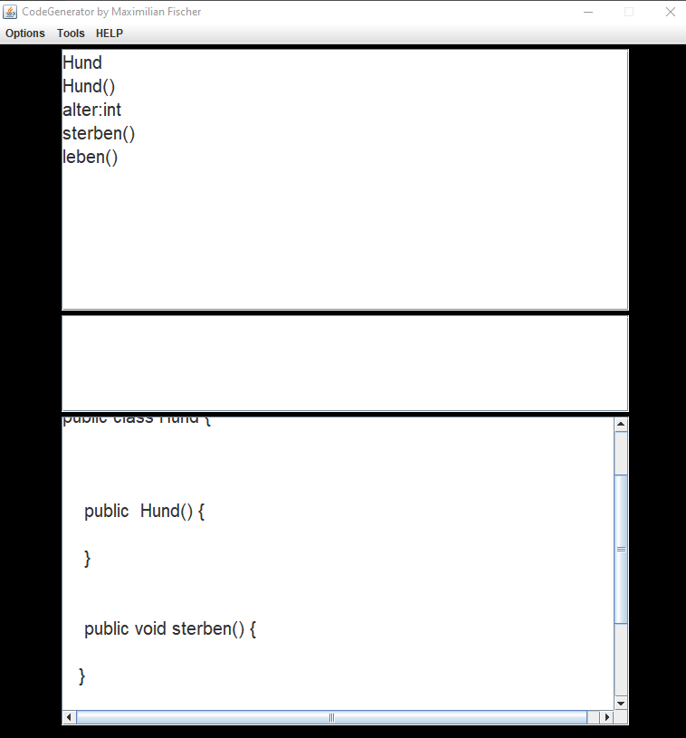

## Java Code Generator 

This is a Generator for Java code.

- Motivation
- Description
- Features
- Learnings
- External Tools

## Motivatation
My motivation for this Project was to learn java and java swing. 

## Description
This Programm allows the user to create the basics of a java class from a UML class Diagramm.

## Features
- Save
- Load
- Generate Java Code(Constructor, Methodes, Attributes, Paramters...)
- Disable type Check
- Error log

## Learnings
- Java swing 
- Java

## External
- Java
- Java swing